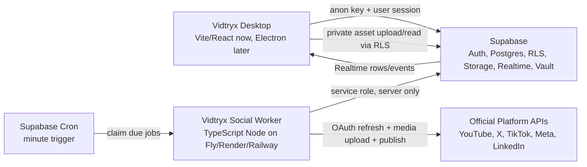

# Vidtryx Social API Infrastructure

Vidtryx social posting uses Supabase as the product backend and a separate TypeScript worker for platform publishing. The desktop app is only a client. It never receives service-role credentials, OAuth client secrets, customer refresh tokens, or decrypted platform tokens.

## System Shape



## Local Files

- Supabase schema/RLS: `supabase/migrations/202605310001_social_api_infrastructure.sql`
- Shared API contract: `packages/social-contract/src/index.ts`
- Platform capability registry: `packages/social-contract/src/platformCapabilities.ts`
- Worker scaffold: `apps/social-worker/src/index.ts`
- Desktop adapter: `apps/desktop/src/state/socialBackend.ts`

## Supabase Setup

1. Create a Supabase project.
2. Run the migration in `supabase/migrations/202605310001_social_api_infrastructure.sql`.
3. Enable email/social auth providers for Vidtryx customer login.
4. Confirm the private Storage bucket exists: `vidtryx-assets`.
5. Enable Realtime for:
   - `platform_accounts`
   - `publish_jobs`
   - `publish_events`
6. Enable Supabase Vault for app-level OAuth client secrets.
7. Create a workspace row after profile creation. The migration adds the owner as a workspace member automatically.

Storage object paths should start with the workspace id:

```txt
{workspace_id}/capsules/{capsule_id}/video.mp4
{workspace_id}/capsules/{capsule_id}/thumbnail.jpg
{workspace_id}/staging/{publish_job_id}/video.mp4
```

The storage RLS policy parses the first path segment as the workspace id.

## Environment Variables

Desktop public env only:

```bash
VITE_VIDTRYX_SOCIAL_BACKEND=supabase
VITE_SUPABASE_URL=https://PROJECT.supabase.co
VITE_SUPABASE_ANON_KEY=SUPABASE_ANON_KEY
VITE_VIDTRYX_WORKSPACE_ID=WORKSPACE_UUID
```

Worker private env:

```bash
SUPABASE_URL=https://PROJECT.supabase.co
SUPABASE_SERVICE_ROLE_KEY=SUPABASE_SERVICE_ROLE_KEY
VIDTRYX_WORKER_ID=vidtryx-social-worker-prod-1
VIDTRYX_MAX_JOBS=10
VIDTRYX_CONNECTOR_MODE=fake
```

Use `VIDTRYX_CONNECTOR_MODE=live` only after real provider connectors and OAuth credential storage are implemented for a provider.

## Token Storage

App-level OAuth client secrets belong in Supabase Vault.

Customer platform tokens belong server-side only:

- Public metadata goes in `platform_accounts`.
- Secret references/encrypted tokens go in `private.platform_tokens_private`.
- OAuth state/PKCE verifier metadata goes in `private.oauth_states_private`.
- The `private` schema is revoked from anon/authenticated users and granted to `service_role`.

Desktop should display only:

- provider
- handle/display name
- scopes
- status
- token expiry
- connection/reauth/approval state

Desktop must not query token tables.

## OAuth Endpoints To Add

The migration and worker scaffold prepare storage and publishing. The next backend piece is a small hosted HTTP boundary for OAuth and user actions:

```txt
POST /oauth/:provider/start
GET  /oauth/:provider/callback
POST /post-packages
POST /distribution-runs
POST /platform-accounts/:id/revoke
GET  /platforms/capabilities
```

These can be implemented as Supabase Edge Functions for short operations. Do not use Edge Functions for long video uploads. Publishing runs in the TypeScript worker.

## Worker Flow

The worker runs on a schedule:

1. Supabase Cron triggers the worker every minute.
2. Worker calls `claim_due_publish_jobs(max_jobs, worker_id)`.
3. The claim RPC uses `FOR UPDATE SKIP LOCKED` so two workers do not publish the same job.
4. Worker loads `post_packages` and `platform_accounts`.
5. Worker validates account/package consistency.
6. Worker refreshes/decrypts token in the future live connector.
7. Worker uploads media and publishes through the official API.
8. Worker updates `publish_jobs`.
9. Worker inserts `publish_attempts` and `publish_events`.
10. Desktop receives status changes through Supabase Realtime.

Current scaffold supports the fake connector path. Live connectors intentionally return blocked/not-configured until OAuth/token work is added.

## Platform Rollout

1. YouTube Shorts
   - Google Cloud project
   - YouTube Data API enabled
   - Scope: `https://www.googleapis.com/auth/youtube.upload`
   - Upload via `videos.insert`

2. X
   - X Developer app
   - OAuth 2.0 PKCE
   - Scopes: `tweet.write`, `tweet.read`, `users.read`, `media.write`, `offline.access`
   - Upload media first, then create post with media id

3. TikTok
   - TikTok developer app
   - Content Posting API product
   - Approved `video.publish`
   - Direct Post flow with explicit user consent

4. Instagram/Facebook
   - Meta app
   - Business verification and app review
   - Professional Instagram account/page setup
   - Re-verify current permission names inside Meta dashboard before implementation

5. LinkedIn
   - Videos API upload registration
   - Posts API publish
   - `w_member_social` or organization equivalent
   - LinkedIn version headers

Threads should wait until Meta auth and publishing are stable.

## Verification

Run contract and worker checks:

```bash
./apps/desktop/node_modules/.bin/tsc -p packages/social-contract/tsconfig.json --noEmit
./apps/desktop/node_modules/.bin/tsc -p apps/social-worker/tsconfig.json --noEmit
```

Run desktop checks:

```bash
cd apps/desktop
npm run lint
npm run build
```

Run the worker once in fake mode after Supabase env is set:

```bash
cd apps/social-worker
VIDTRYX_CONNECTOR_MODE=fake node --experimental-strip-types src/index.ts
```

## Security Rules

- No service-role key in desktop or Electron renderer.
- No customer refresh tokens in desktop state, local storage, logs, Realtime, or browser devtools.
- No raw provider request bodies in `publish_attempts`.
- Store sanitized provider response summaries only.
- Treat failed OAuth state validation as a security event.
- Direct upload APIs are preferred when available.
- Short-lived staging URLs are only for platforms that require media pull by URL.
